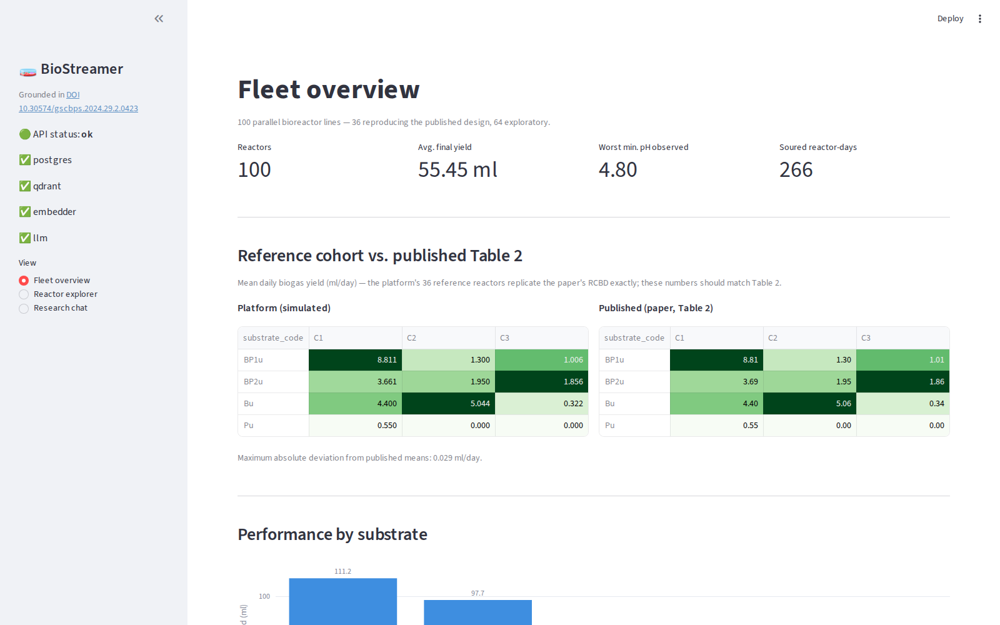
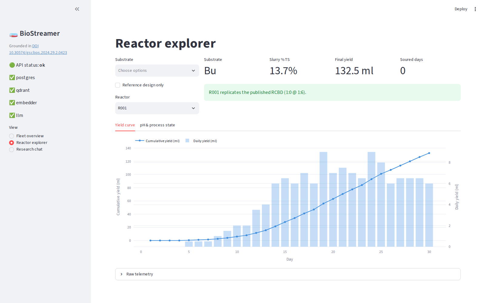
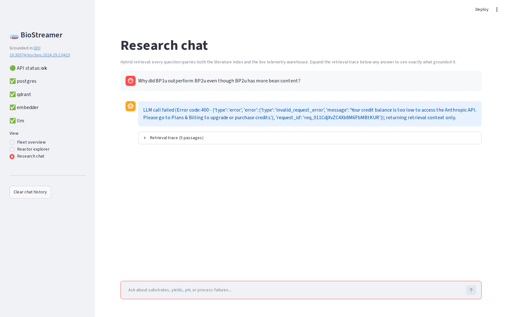
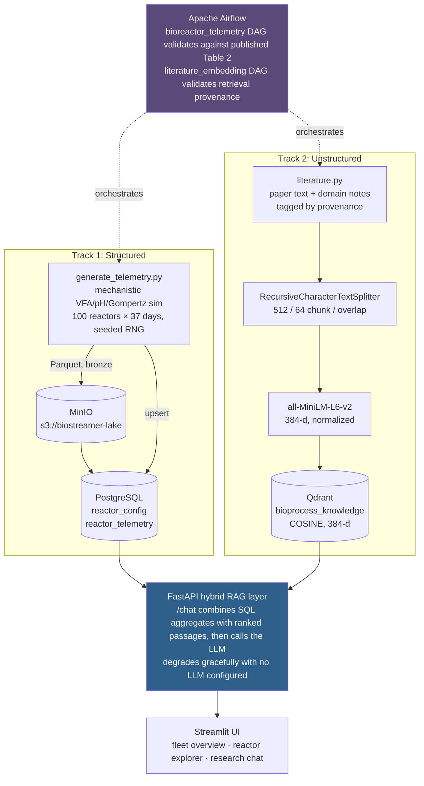

# 🧫 BioStreamer

**A hybrid structured/unstructured data platform for scaling anaerobic digestion research beyond what manual telemetry logging supports.**

BioStreamer simulates, warehouses, and reasons over daily telemetry for 100 parallel bioreactor lines. It tracks pH, volatile fatty acids, alkalinity, and biogas yield, all grounded in a peer-reviewed factorial co-digestion study. It pairs that with a literature-aware retrieval layer so numeric answers and mechanistic explanations both come from verified sources, never from a language model's memory.

> 📄 Full design rationale: [`ARCHITECTURE.md`](ARCHITECTURE.md).Note: This repository represents the refactored, production-ready version of BioStreamer, consolidated and documented for release.

---

## Screenshots

**Fleet overview.** The platform's 36 reference reactors reproducing the source paper's Table 2, side by side, plus the 100-reactor fleet's performance by substrate.



**Reactor explorer.** Cumulative and daily yield for any of the 100 reactors, with the reference-design cohort flagged.



**Research chat.** Hybrid retrieval with the full trace exposed. Here it caught its own LLM call failing (an exhausted API key) and correctly returned the retrieval context anyway, rather than failing the request.



---

## The problem

A 36-digester factorial anaerobic digestion study, observed daily for 37 days, requires upward of **1,300 manual water-displacement readings**, each read off a calibrated cylinder and hand-transcribed into a spreadsheet. That logging burden, not digester capacity, is what caps how large a co-digestion or concentration-response study a small lab can attempt.

BioStreamer removes that ceiling. It automates acquisition and interpretation for a fleet an order of magnitude larger, while staying accountable to the science. The platform's reference cohort is required, by an automated pipeline gate rather than a one-off check, to reproduce the source study's published yields before any of its output is trusted.

---

## Use case

| Who | What they get |
|---|---|
| **A researcher scaling past bench-scale** | 100 simulated reactor lines instead of 36, spanning a continuous design space (bean:plantain ratio × 5-25% total solids) the original 36-digester budget couldn't explore. The 36 reactors that *do* replicate the published design are calibrated to its Table 2 means (residual under 0.042 ml/day); what the mechanistic model then determines on its own is which reactors sour and when. |
| **Someone debugging a failing reactor** | The `/chat` endpoint and Streamlit UI answer "why is R047 souring?" by combining that reactor's exact pH/VFA trace (SQL) with the literature's explanation of VFA-driven methanogen inhibition (vector search). Never a guess, always attributed. |
| **A reviewer auditing a claim** | Every chat answer ships with its retrieval trace: the exact passages and warehouse aggregates that grounded it, each tagged `published_finding` (from the source paper) or `domain_context` (general process chemistry, not what the paper measured). A claim can never be mistaken for a result the study didn't report. |
| **A data engineer evaluating the pattern** | A worked example of hybrid RAG over a quantitative domain. SQL handles the numbers a vector store can't compute, vectors handle the mechanism SQL can't explain, orchestrated by Airflow with a scientific-reproduction gate in the DAG's critical path. |

---

## Architecture & data flow

Two ingestion tracks converge on a unified retrieval layer. Full narrative in [`ARCHITECTURE.md`](ARCHITECTURE.md); this is the shape of it:



**Why hybrid, not vector-only.** A vector store retrieves a passage that *discusses* yields; it cannot compute a mean over 3,700 telemetry rows. SQL returns exact numbers with no mechanism. Every `/chat` call runs both retrievals and hands the language model labelled context from each, so it composes an answer instead of doing the arithmetic itself.

**The validation gate.** Both Airflow DAGs fail closed. `bioreactor_telemetry` refuses to load a dataset into the warehouse unless its 36-reactor reference cohort reproduces the published mean yields within tolerance. `literature_embedding` refuses to consider indexing complete unless three retrieval probes return the expected provenance class. A pipeline that silently drifts from ground truth is a worse failure mode here than one that stops.

---

## Stack

| Layer | Technology | Role |
|---|---|---|
| Structured warehouse | **PostgreSQL 15** | Reactor config + daily telemetry, with `CHECK` constraints encoding the scientific envelope |
| Vector store | **Qdrant** | `bioprocess_knowledge` collection, cosine distance, 384-d |
| Data lake (bronze) | **MinIO** | S3-compatible landing zone for generated telemetry Parquet |
| Orchestration | **Apache Airflow 2.8** | Two DAGs, each with a validation task in the critical path |
| Embedding model | **sentence-transformers/all-MiniLM-L6-v2** | CPU-inferable, 384-d, roughly 16 ms per query once resident |
| Chunking | **langchain-text-splitters** | `RecursiveCharacterTextSplitter`, 512/64 chunk/overlap |
| API | **FastAPI** | Structured endpoints plus the hybrid `/chat` route |
| LLM | **Anthropic Claude** (`claude-opus-5` default) | Synthesis only. Never sees a question without grounding, and degrades gracefully with no key configured |
| UI | **Streamlit** + **Plotly** | Fleet overview, reactor explorer, research chat with exposed retrieval trace |
| Simulation | **NumPy / pandas** | Coupled acidogenesis/methanogenesis kinetic model, modified Gompertz envelope |

---

## Project structure

```
biostreamer/
├── ARCHITECTURE.md              # full system design rationale
├── docker-compose.yml           # postgres, qdrant, minio, airflow
├── requirements.txt
├── .env.example                 # copy to .env and fill in
├── airflow/dags/
│   ├── bioreactor_telemetry_dag.py     # Track 1: simulate, validate, land, load, verify
│   └── literature_embedding_dag.py     # Track 2: chunk, embed and index, verify retrieval
└── src/
    ├── common/
    │   ├── science.py           # every measured constant from the source paper (single source of truth)
    │   ├── literature.py        # corpus, tagged published_finding / domain_context
    │   └── config.py            # env-driven settings
    ├── db/schema.sql            # warehouse schema + analytical views
    ├── pipelines/
    │   ├── generate_telemetry.py
    │   ├── load_telemetry.py
    │   └── embed_literature.py
    ├── api/main.py              # FastAPI hybrid RAG service
    └── ui/app.py                # Streamlit UI
```

---

## Running it

### Prerequisites

- Docker + Docker Compose
- Python 3.10+
- Roughly 3 GB free disk (mostly the CPU-only PyTorch build for the embedding model)

### 1. Start the infrastructure

```bash
docker compose up -d postgres qdrant minio
```

Airflow needs Postgres healthy first, then takes a minute or two on first boot (it migrates its metadata DB and installs the pipeline's Python dependencies):

```bash
docker compose up -d airflow
```

These are local dev defaults, set in `docker-compose.yml` for a Codespace or laptop, not production credentials. Change them before deploying anywhere reachable outside your machine.

| Service | URL | Local dev login |
|---|---|---|
| Airflow UI | http://localhost:8080 | `admin` / `adminpassword` |
| MinIO console | http://localhost:9001 | `admin` / `adminpassword` |
| Qdrant API | http://localhost:6333 | none |
| PostgreSQL | `localhost:5432` | `data_engineer` / `biostream_dev_pw`, db `biostream_db` |

### 2. Configure environment

```bash
cp .env.example .env
```

Fill in `ANTHROPIC_API_KEY` to enable synthesized chat answers. **Everything else works without it.** `/chat` returns the retrieved literature passages and SQL aggregates directly, just without an LLM-composed answer.

### 3. Install Python dependencies (for running pipelines/API/UI outside Docker)

```bash
pip install -r requirements.txt
```

### 4. Run the pipelines

Either trigger them from the Airflow UI (`bioreactor_telemetry`, `literature_embedding`), or run them directly:

```bash
# Track 1: simulate 100 reactors x 37 days, validate against the published paper, load to Postgres
python -m src.pipelines.load_telemetry

# Track 2: chunk the literature corpus, embed it, index into Qdrant
python -m src.pipelines.embed_literature
```

Both print a pass/fail summary. The telemetry loader shows the 12-cell comparison against the paper's Table 2; the embedding pipeline reports how many chunks landed under each provenance tag.

### 5. Start the API and UI

```bash
# Terminal 1
python -m uvicorn src.api.main:app --host 0.0.0.0 --port 8000

# Terminal 2
python -m streamlit run src/ui/app.py --server.port 8501
```

Open **http://localhost:8501**. Check **http://localhost:8000/health** first if anything looks off. It reports Postgres, Qdrant, the embedding model, and the LLM client independently.

### Quick sanity checks

```bash
# Does the reference cohort reproduce the published paper?
curl -s localhost:8000/stats/summary | python3 -m json.tool

# Ask a question (works with or without ANTHROPIC_API_KEY)
curl -s -X POST localhost:8000/chat -H "Content-Type: application/json" \
  -d '{"question": "Why did BP1u outperform BP2u?"}' | python3 -m json.tool
```

---

## Validation

The platform is evaluated against the study it's grounded in, not just its own internal consistency. It is worth being precise about what "reproduces the paper" means here, since two different things are being claimed:

- **Absolute yields are calibrated, not independently predicted.** `generate_telemetry.py` runs a two-pass process: a mechanistic pass sets the shape of each reactor's daily output (when gas appears, how a pH crash suppresses it), then a second pass scales that raw series so its window mean matches the paper's Table 2 mean for that cell, capped at 4x to stop the scaling from inflating a reactor the mechanism genuinely drove to failure. For the 36 reference-design reactors this means the mean yield matches the paper largely by construction. The residual that survives calibration and rounding, a **maximum absolute deviation of 0.042 ml/day** across all twelve cells, is a measure of calibration precision, not of independent predictive accuracy.
- **What the mechanism determines on its own** is which reactors sour and when, since souring depends on the VFA-to-alkalinity balance and the pH gate, not on the calibration target. That is why Pu at C2 and C3 lands at 0.00 ml/day without ever being told to: its long unseeded lag and thin nitrogen buffer drive it there mechanistically. The same logic governs the 64 exploratory reactors beyond the published design: 361 soured reactor-days appear above roughly 20% total solids, and zero within the published envelope, purely from the pH-gate dynamics.
- **Retrieval provenance** was verified against three representative questions (comparative-yield, process-mechanism, factual-recall). The top-ranked passage carried the correct `published_finding` / `domain_context` tag in every case, and this check is now an automated gate in the `literature_embedding` DAG.
- **Graceful degradation** was exercised under a real failure condition (an exhausted API key). `/chat` correctly surfaced the billing error while still returning full retrieval context, rather than failing the request outright.

---

## Source study

Nnokwe, J.C., Orji, M.U., Ajuruchi, V.C., Jonas, K.C. (2024). *Effects of slurry concentration and co-digestion on biogas yields from unseeded Phaseolus vulgaris (bean) peels chaff and unseeded Musa paradisiaca (plantain) peels chaff.* GSC Biological and Pharmaceutical Sciences, 29(02), 214-218. [10.30574/gscbps.2024.29.2.0423](https://doi.org/10.30574/gscbps.2024.29.2.0423)
